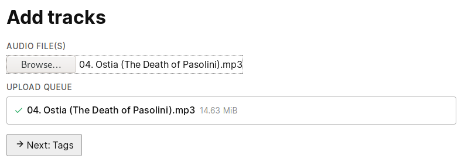

# Ostia

This is going to be a self-hosted music streaming service.  For now, it's a huge
work in progress, code changes rapidly and commit history isn't the prettiest.
Much of the code was written in one night, so it isn't pretty either.  But hey,
it already plays songs!

Of course, I'm not responsible for any illegal use.  Use common sense.

## Screenshots

The UI will change, too.

Uploading files.

Finalizing upload.  One day, you will be able to tag your music here.

Track library.  You can play songs and not much more.
